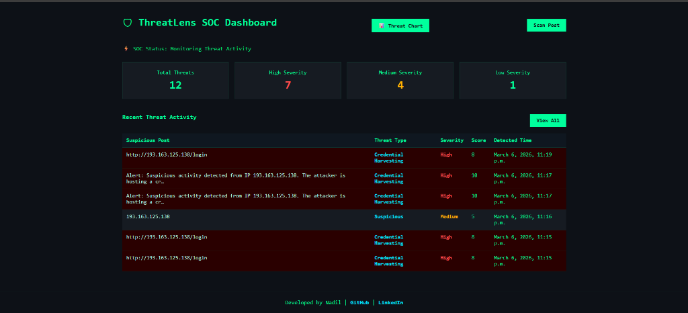
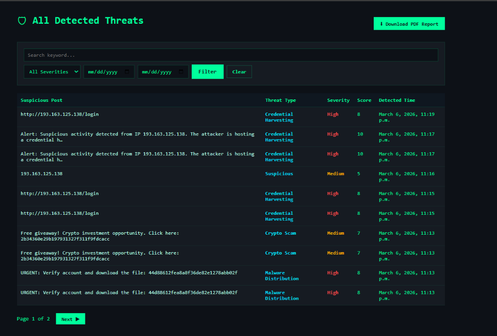
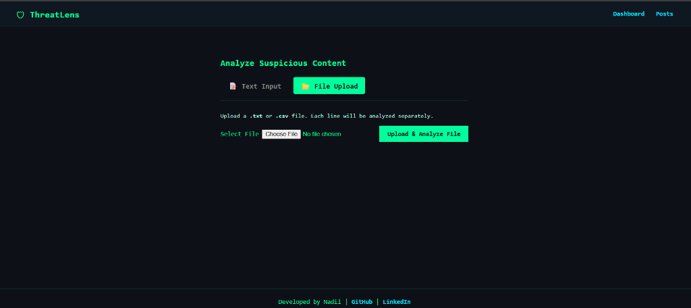
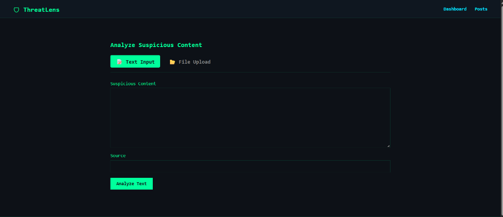
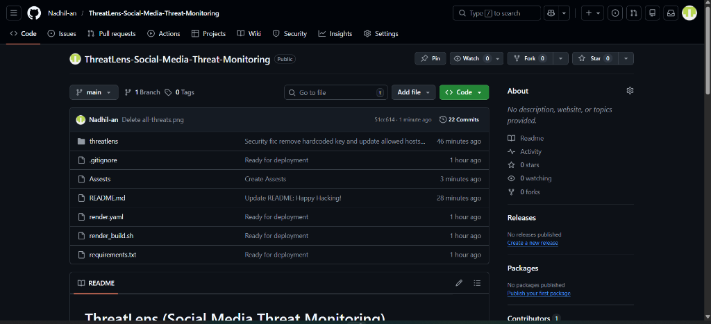

# ThreatLens (Social Media Threat Monitoring)

ThreatLens is a modern Django-based web application designed to monitor and analyze potential cyber threats from social media and messaging platforms like Telegram. It integrates with real-time threat intelligence APIs to provide automated scoring and severity classification.

## 🚀 Key Features

- **Multi-Platform Monitoring:** Track and sync messages from Telegram channels.
- **Automated Threat Detection:** Extracts and analyzes URLs, Domains, IPs, and Hashes.
- **Threat Intelligence Integration:**
  - **VirusTotal:** Check file hashes and domains for malicious activity.
  - **AbuseIPDB:** Verify IP reputation and abuse confidence scores.
  - **URLScan.io:** Generate dynamic screenshots of suspicious links.
- **MITRE ATT&CK Mapping:** Automatically maps detected threats to the MITRE framework.
- **Severity Scoring:** Classifies threats (Low, Medium, High) based on cumulative indicators.
- **Admin Dashboard:** Manage and investigate detected threats through a clean interface.

## 📸 Screenshots

### SOC Dashboard


### Threat Analysis (Text Input)


### Threat Analysis (File Upload)


### All Detected Threats


### Detailed Threat Investigation


## 🛠️ Tech Stack

- **Framework:** Django (Python)
- **Database:** PostgreSQL (Production) / SQLite (Local)
- **Styling:** Vanilla CSS with a responsive Design System
- **Deployment:** Render (Web Service) & Neon (Managed Postgres)
- **Caching/Static:** WhiteNoise

## 💻 Local Setup

1. **Clone the repository:**
   ```bash
   git clone https://github.com/Nadhil-an/ThreatLens-Social-Media-Threat-Monitoring.git
   cd ThreatLens-Social-Media-Threat-Monitoring
   ```

2. **Create a virtual environment:**
   ```bash
   python -m venv venv
   source venv/bin/activate  # On Windows: venv\Scripts\activate
   ```

3. **Install dependencies:**
   ```bash
   pip install -r requirements.txt
   ```

4. **Environment Variables:**
   Create a `.env` file in the root directory and add your keys:
   ```env
   SECRET_KEY=your_django_secret
   TELEGRAM_API_ID=xxx
   TELEGRAM_API_HASH=xxx
   VIRUSTOTAL_API_KEY=xxx
   URLSCAN_API_KEY=xxx
   ABUSEIPDB_API_KEY=xxx
   ```

5. **Run Migrations & Start Server:**
   ```bash
   python threatlens/manage.py migrate
   python threatlens/manage.py runserver
   ```

## 🌐 Live Deployment
The project is configured for one-click deployment on **Render**. It includes a `render_build.sh` script to automate dependencies and migrations.

---
Happy Hacking
